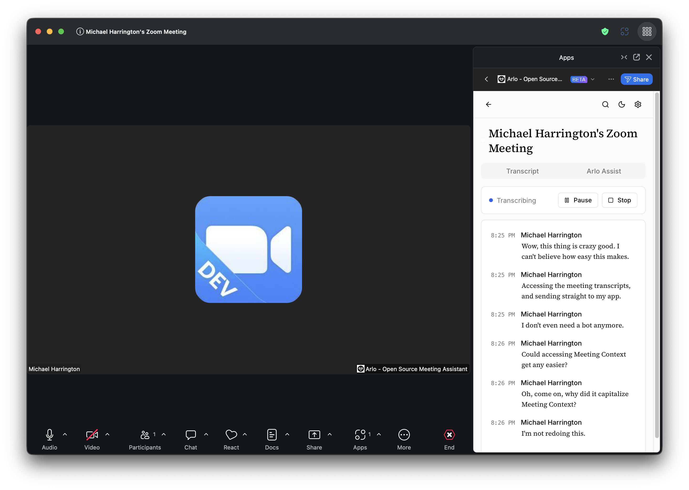

<div align="center">



# Arlo Meeting Assistant 🦉

**Your intelligent meeting companion that lives inside Zoom**

</div>

---

Arlo is a forkable, open-source **RTMS Meeting Assistant** that showcases how developers can build real-time, intelligent meeting experiences directly inside Zoom — **no meeting bot required!**

This project was originally created as the "Meeting Assistant Starter Kit" and has evolved into **Arlo**, a lightweight example of how to:
- Stream and display live meeting transcripts in real time
- Save transcripts to a database for meeting history
- Generate AI-powered summaries and action items
- Search across past meetings
- Extend functionality using Zoom's Real-Time Media Streams (RTMS) APIs

Arlo is designed to help developers quickly prototype and deploy their own meeting assistants as Zoom Apps.

---

## ⚠️ **IMPORTANT: RTMS Access Required**

> **This app requires RTMS (Real-Time Media Streams) access to function.** RTMS is Zoom's API for accessing live meeting audio and transcription data without requiring a bot in the meeting.

**To get RTMS access:**

1. **Fill out the RTMS access form** at [zoom.com/realtime-media-streams](https://www.zoom.com/en/realtime-media-streams/#form)
2. **Describe your use case** - Mention you're building a meeting assistant
3. **Wait for approval** - The Zoom team will review your request and enable RTMS on your account

**Without RTMS access, this application will not work.** The entire purpose of this starter kit is to demonstrate the power of RTMS for building real-time meeting intelligence.

✅ Once approved, you'll see **RTMS features** available in your Zoom App Marketplace settings.

---

## ✨ Features

- 📝 **Live Transcription** - Real-time captions via RTMS (< 1s latency)
- 🤖 **AI Insights** - Summaries, action items, next steps (OpenRouter with free models)
- 🔍 **Full-Text Search** - Search across all meeting transcripts
- 💬 **Chat with Transcripts** - RAG-based Q&A over your meetings
- 🎯 **Meeting Highlights** - Create bookmarks with timestamps
- 📤 **Export VTT** - Download WebVTT files for video players
- 🏠 **Home Dashboard** — AI highlights and reminders from recent meetings
- 🌙 **Dark Mode** — OS detection with manual toggle, persisted preference
- 📄 **Export Markdown** — Download meeting summary + transcript as MD
- 🏗️ **Multi-View Architecture** — 14 views with HashRouter, shared AppShell
- 🔐 **Secure** - Zoom OAuth, encrypted tokens, ownership-enforced data isolation, rate limiting, HMAC webhook verification
- 🏥 **Industry Verticals** — Specialized modes for Healthcare, Legal, Sales, Finance, and general note-taking

---

## 🏥 Industry Verticals

Arlo supports **industry-specific modes** that customize the AI prompts, features, terminology, and UI for different use cases. Select your vertical during first-run setup or change it anytime in Settings.

### Healthcare (Clinical Documentation)

Designed for doctors and clinicians who need to document patient encounters while staying present with their patients.

- **SOAP Notes Panel** — Auto-populated Subjective, Objective, Assessment, and Plan sections
- **Visit Templates** — Pre-configured templates for different encounter types
- **ICD-10/CPT Codes** — AI-suggested diagnosis and procedure codes
- **Patient Context** — Sidebar showing conditions, allergies, and medications
- **Previous Sessions** — Quick access to past appointment notes
- **Clinical Alerts** — Real-time warnings for drug interactions, contradictions, allergy mentions
- **Quick Actions** — One-click lab orders, referrals, Rx templates, follow-up scheduling
- **Patient Summary** — Generate plain-language handouts for patients

### Legal (Depositions & Testimony)

Built for attorneys handling depositions, client interviews, and witness testimony.

- **Contradiction Detector** — Flags conflicting statements with severity levels and side-by-side comparison
- **Key Terms Panel** — Auto-extracts parties, dates, amounts, locations, documents, and legal citations
- **Exhibit Tracker** — Log and track document references with timestamps and context
- **Privilege Markers** — Mark attorney-client, work product, and confidential sections
- **Objection Log** — Quick-add common objections (leading, compound, relevance, assumes facts)
- **Certified Timestamps** — All transcript segments include precise timestamps for the record

### Notes (General Purpose)

The default mode for general meeting notes, action items, and summaries.

### Sales & Finance

Coming soon — specialized features for deal tracking, compliance documentation, and more.

---

## 🚀 Quick Start

### Prerequisites

- **Node.js** 20+ ([Download](https://nodejs.org/))
- **Docker** + Docker Compose ([Download](https://www.docker.com/))
- **ngrok** account + CLI ([Sign up free](https://ngrok.com/)) - Exposes localhost to internet for webhooks
- **Zoom Account** with Marketplace access
- **🔴 RTMS Access** - **REQUIRED!** [Request access here](https://www.zoom.com/en/realtime-media-streams/#form)

**💡 Recommended:** Create a free ngrok account to get a static domain - makes webhook testing much easier!

### 1. Clone Repository

```bash
git clone https://github.com/your-org/arlo-meeting-assistant.git
cd arlo-meeting-assistant
```

### 2. Request RTMS Access (Critical!)

**This step is required before you can use RTMS features:**

1. Go to [zoom.com/realtime-media-streams](https://www.zoom.com/en/realtime-media-streams/#form)
2. Fill out the access request form with your details
3. Describe your use case (e.g., "Building a real-time meeting assistant with live transcription")
4. **Wait for approval** - The Zoom team will review and enable RTMS on your account
5. Once approved, RTMS features will appear in your Zoom App settings

### 3. Create Zoom App

1. Go to [Zoom App Marketplace](https://marketplace.zoom.us/)
2. Click **Develop** → **Build App** → **General App**
3. Name your app (e.g., "Arlo Meeting Assistant")
4. Note your **Client ID** and **Client Secret**

> **App Manifest (Beta):** If you have access to the Zoom App Manifest beta, you can upload `zoom-app-manifest.json` from this repo to pre-configure your app's scopes, SDK capabilities, event subscriptions, and more. See [App Manifest](#-app-manifest-beta) below for details.

### 4. Configure Environment

```bash
# Copy example environment file
cp .env.example .env

# Generate secrets
node -e "console.log(require('crypto').randomBytes(32).toString('hex'))"  # SESSION_SECRET
node -e "console.log(require('crypto').randomBytes(16).toString('hex'))"  # REDIS_ENCRYPTION_KEY

# Edit .env and add:
# - ZOOM_CLIENT_ID
# - ZOOM_CLIENT_SECRET
# - SESSION_SECRET (generated above)
# - REDIS_ENCRYPTION_KEY (generated above)
```

### 5. Set Up ngrok (Expose Local Server to Internet)

ngrok creates a secure tunnel from the internet to your local development server, which is required for Zoom webhooks and OAuth callbacks.

**First Time Setup:**

1. **Create a free ngrok account** at [ngrok.com](https://ngrok.com/)
2. **Install ngrok** (if not already installed):
   ```bash
   # macOS (Homebrew)
   brew install ngrok

   # Or download from https://ngrok.com/download
   ```

3. **Authenticate ngrok** with your account:
   ```bash
   ngrok config add-authtoken YOUR_AUTHTOKEN
   ```
   (Find your authtoken at https://dashboard.ngrok.com/get-started/your-authtoken)

**🎯 Recommended: Use a Static Domain (FREE!)**

ngrok now offers **free static domains** that don't change between restarts. This makes webhook configuration much easier since you won't need to update your Zoom App settings every time you restart ngrok.

1. **Claim your free static domain:**
   - Go to https://dashboard.ngrok.com/domains
   - Click **"Create Domain"** or **"New Domain"**
   - You'll get a permanent domain like: `yourname-arlo.ngrok-free.app`

2. **Start ngrok with your static domain:**
   ```bash
   ngrok http 3000 --domain=yourname-arlo.ngrok-free.app
   ```

3. **Benefits:**
   - ✅ Same URL every time you restart ngrok
   - ✅ Configure Zoom webhooks once (no need to update)
   - ✅ Easier testing workflow
   - ✅ 100% free for development

**Alternative: Use Random Domain (Changes Each Time)**

If you prefer not to create an account or want a temporary setup:

```bash
ngrok http 3000
```

Copy the `https://` URL from the ngrok output (e.g., `https://abc123.ngrok-free.app`)

⚠️ **Note:** This URL changes every time you restart ngrok, requiring you to update all Zoom App webhook URLs each time.

**Verify ngrok is running:**

Open your ngrok URL in a browser - you should see the Arlo frontend once the app is running.

### 6. Update Zoom App Configuration

In Zoom Marketplace → Your App:

**Replace `your-ngrok-url.ngrok-free.app` below with your actual ngrok domain:**

**Basic Information:**
- OAuth Redirect URL: `https://your-ngrok-url.ngrok-free.app/api/auth/callback`
- OAuth Allow List: `https://your-ngrok-url.ngrok-free.app`

**Features → Zoom App SDK:**
- Add all required APIs (see [CLAUDE.md](./CLAUDE.md#required-capabilities))
- ⚠️ **Enable RTMS → Transcripts** (requires RTMS access approval)
- Optional: Enable RTMS → Audio (for advanced features)

**Features → Surface:**
- Home URL: `https://your-ngrok-url.ngrok-free.app`
- Add to Domain Allow List: `https://your-ngrok-url.ngrok-free.app`

**Event Subscriptions (Important for RTMS!):**
- Event notification endpoint URL: `https://your-ngrok-url.ngrok-free.app/api/rtms/webhook`
- Subscribe to events:
  - ✅ `meeting.rtms_started` - Notifies when RTMS successfully starts
  - ✅ `meeting.rtms_stopped` - Notifies when RTMS ends
- **Copy your webhook URL** from the "Event notification endpoint URL" field - you'll need this for testing

**💡 Pro Tip:** If you're using a static ngrok domain, you only need to configure these webhooks once! With random domains, you'd need to update this URL every time you restart ngrok.

**⚡ Optional: Auto-Start RTMS**

To automatically start RTMS when meetings begin (without requiring users to click a button):

1. In **Features → Event Subscriptions**, also subscribe to:
   - `meeting.participant_joined` (to detect when you join a meeting)

2. In your backend code (`backend/src/routes/rtms.js`), add a webhook handler:
   ```javascript
   // Auto-start RTMS when participant joins
   if (event === 'meeting.participant_joined') {
     const { meeting_uuid, participant } = payload;
     // Check if this is the app user
     if (participant.id === appUserId) {
       await startRTMS(meeting_uuid);
     }
   }
   ```

3. **Trade-off:** Auto-start provides seamless UX but uses more RTMS quota. Manual start (current implementation) gives users control.

**Note:** The current implementation uses manual start (user clicks "Start Arlo") for better control and transparency.

### 7. Update .env with ngrok URL

```bash
# Edit .env
PUBLIC_URL=https://your-ngrok-url.ngrok-free.app
```

### 8. Start Application

```bash
# Install root dependencies
npm install

# Start with Docker (recommended)
docker-compose up --build

# OR start manually
npm run setup     # Install all dependencies
npm run db:migrate  # Run database migrations
npm run dev       # Start all services
```

### 9. Test in Zoom

1. Start or join a Zoom meeting
2. Click **Apps** → Find your app
3. Click **Add App** (first time only)
4. Authorize the app
5. Click **"Start Arlo"**
6. See live transcription appear!

---

## 📚 Documentation

Comprehensive guides available in [`/docs/`](./docs/):

- **[CLAUDE.md](./CLAUDE.md)** - Quick reference for Claude Code
- **[Architecture](./docs/ARCHITECTURE.md)** - System design and data flow
- **[Project Status](./docs/PROJECT_STATUS.md)** - Roadmap and phases
- **[Specification](./SPEC.md)** - Feature spec and version milestones
- **[Troubleshooting](./docs/TROUBLESHOOTING.md)** - Common issues
- **[Zoom Apps Skills](./.claude/skills/zoom-apps/)** - SDK setup, RTMS guide, OAuth, security

---

## 🏗️ Architecture

```
┌─────────────────────────────────────────────────────────┐
│                    Zoom Meeting                         │
│  ┌──────────────────────────────────────────────────┐   │
│  │  Arlo Meeting Assistant (React + Zoom SDK)       │   │
│  └────────────────────┬─────────────────────────────┘   │
└─────────────────────────┼──────────────────────────────┘
                          │ HTTPS + WebSocket
         ┌────────────────▼────────────────┐
         │   Backend API (Express.js)      │
         │   - OAuth 2.0 (PKCE)            │
         │   - WebSocket Server            │
         │   - RTMS Ingestion              │
         └────┬───────────┬────────────────┘
              │           │
    ┌─────────▼───┐   ┌───▼──────────────┐
    │  Postgres   │   │  OpenRouter      │
    │  Database   │   │  (Free AI)       │
    └─────────────┘   └──────────────────┘
```

**Tech Stack:**
- Frontend: React 18, Zoom Apps SDK 0.16, react-router-dom 6 (HashRouter), @base-ui/react, lucide-react
- Fonts: Source Serif 4 + Inter (self-hosted WOFF2)
- Backend: Node.js 20, Express, Prisma
- Database: PostgreSQL 15
- AI: OpenRouter (free models, no API key required)
- Real-time: WebSocket + RTMS SDK

---

## 🛠️ Development

### Project Structure

```
arlo-meeting-assistant/
├── backend/          # Express API server
│   ├── src/
│   │   ├── server.js       # Main server + rate limiting
│   │   ├── config.js       # Environment config
│   │   ├── lib/prisma.js   # Singleton PrismaClient
│   │   ├── routes/         # API routes (9 modules)
│   │   └── services/       # Business logic
│   └── prisma/
│       └── schema.prisma   # Database schema
│
├── frontend/         # React Zoom App
│   ├── public/
│   │   ├── index.html      # Loads Zoom SDK
│   │   └── fonts/          # Self-hosted Source Serif 4 + Inter
│   └── src/
│       ├── App.js           # HashRouter, routes, provider hierarchy
│       ├── index.css        # Design tokens, typography, themes
│       ├── views/           # 15 views (Auth, Home, MeetingsList, MeetingDetail, InMeeting, Search, Settings, Upcoming, Guest×2, Landing, Onboarding, OAuthError, NotFound, VerticalSelector)
│       ├── contexts/        # 6 contexts (Auth, ZoomSdk, Meeting, Theme, Toast, Vertical)
│       ├── features/        # Industry vertical components
│       │   ├── healthcare/  # SOAP notes, clinical alerts, patient context, quick actions
│       │   └── legal/       # Contradiction detector, exhibit tracker, privilege markers
│       ├── hooks/           # useZoomAuth (OAuth PKCE)
│       ├── utils/           # Shared formatters (timestamps, durations, dates)
│       ├── components/      # AppShell, ArloLogo, DeleteMeetingDialog, ParticipantTimeline, MeetingCard, etc.
│       └── components/ui/   # Button, Card, Badge, Input, Textarea, LoadingSpinner
│
├── rtms/             # RTMS transcript ingestion
│   └── src/
│       └── index.js        # Webhook handler + RTMS client
│
├── docs/             # 15 comprehensive guides
├── .env.example      # Environment variables template
├── zoom-app-manifest.json  # Zoom App Manifest (beta)
├── docker-compose.yml
└── README.md
```

### Common Commands

```bash
# Start all services
docker-compose up

# View logs
docker-compose logs -f backend
docker-compose logs -f rtms

# Restart service
docker-compose restart backend

# Database operations
npm run db:migrate    # Run migrations
npm run db:studio     # Open Prisma Studio GUI
npm run db:reset      # Reset database (WARNING: deletes data)

# Clean restart
docker-compose down -v && docker-compose up --build
```

### Database Migrations

```bash
cd backend

# Create migration after schema changes
npx prisma migrate dev --name description_of_change

# Generate Prisma Client
npx prisma generate

# Reset database (development only)
npx prisma migrate reset
```

---

## 🧪 Testing

### Manual Testing Checklist

- [ ] App loads in Zoom client
- [ ] OAuth flow completes
- [ ] "Start Arlo" button works
- [ ] Live transcript appears within 1s
- [ ] WebSocket connection stable
- [ ] Segments save to database
- [ ] Can scroll through transcript
- [ ] "Resume Live" button works
- [ ] Stop button ends RTMS

### Debugging

**Frontend (Zoom App):**
- Right-click in app → **Inspect Element**
- Check Console for errors
- Network tab shows API calls

**Backend:**
```bash
docker-compose logs -f backend | grep -i error
curl http://localhost:3000/health
```

**Database:**
```bash
npm run db:studio
# Opens GUI at http://localhost:5555
```

**RTMS:**
```bash
docker-compose logs -f rtms
curl http://localhost:3002/health
```

---

## 🤝 Contributing

This is an open-source starter kit designed to be forked and customized!

### How to Customize

1. **Fork this repository**
2. **Modify for your use case:**
   - Add your own AI prompts
   - Customize UI/styling
   - Add new features
   - Change AI provider
3. **Share your improvements** (optional PR)

### Feature Ideas

- Multi-language support
- Custom AI models (local LLMs)
- Team workspaces
- Calendar integration
- Video replay (like Fathom)
- Risk/compliance signals
- Background task extraction
- Public sharing links

---

## 📦 App Manifest (Beta)

Zoom App Manifests are JSON files that contain your app's configuration — scopes, SDK capabilities, event subscriptions, URLs, and more. This repo includes a pre-configured manifest at [`zoom-app-manifest.json`](./zoom-app-manifest.json) that you can upload to quickly configure your Zoom App.

### Prerequisites

- You must be accepted into the **Zoom App Manifest beta program** (request access from Zoom)
- Your app must be a **General App** on the Zoom Marketplace
- You must be the account owner, admin, or have the "Zoom for developers" role

### Using the Manifest

**Before uploading**, edit `zoom-app-manifest.json` and replace all instances of `your-ngrok-url.ngrok-free.app` with your actual ngrok domain (or production domain).

**Upload to an existing app:**

1. Log into [Zoom Marketplace](https://marketplace.zoom.us/) → **Manage** → select your app
2. Open the manifest panel (persistent menu bar or Basic Information page)
3. Click **Upload New Manifest** and select `zoom-app-manifest.json`
4. Zoom validates the manifest and shows a green checkmark on success
5. Close the manifest window, refresh your browser, and confirm changes

**Download from an existing app:**

1. In the manifest panel, click the **download icon** to save the current configuration
2. Edit the JSON locally, then re-upload to apply changes

### What's Included

The manifest pre-configures:

- **OAuth scopes:** `zoomapp:inmeeting`, `meeting:read:meeting`, `meeting:write:open_app` (optional), `user:read` (optional)
- **SDK capabilities:** All 16 APIs used by Arlo (getMeetingContext, callZoomApi, authorize, showNotification, etc.)
- **Event subscriptions:** `meeting.rtms_started`, `meeting.rtms_stopped`
- **In-client OAuth:** Enabled (PKCE flow)
- **Guest mode:** Enabled with test guest mode
- **Domain allow list:** Your ngrok domain + `appssdk.zoom.us`

### Limitations (Beta)

- Manifests can only **update** existing apps, not create new ones
- Only user-editable values are updated; the build-flow UX verifies completeness
- Values are case-sensitive and must match Zoom's expected format
- RTMS access still requires separate approval from Zoom (the manifest alone does not grant RTMS)

---

## 📖 Learn More

- [Zoom Apps Documentation](https://developers.zoom.us/docs/zoom-apps/)
- [RTMS Documentation](https://developers.zoom.us/docs/rtms/)
- [Zoom Apps SDK Reference](https://appssdk.zoom.us/classes/ZoomSdk.ZoomSdk.html)
- [@zoom/rtms SDK](https://github.com/zoom/rtms)
- [OpenRouter API](https://openrouter.ai/docs)

---

## ⚖️ License

MIT License - See [LICENSE](./LICENSE) for details

---

## 💬 Support

- **Issues:** [GitHub Issues](https://github.com/your-org/arlo-meeting-assistant/issues)
- **Discussions:** [GitHub Discussions](https://github.com/your-org/arlo-meeting-assistant/discussions)
- **RTMS Access Requests:** [zoom.com/realtime-media-streams](https://www.zoom.com/en/realtime-media-streams/#form)
- **General Zoom Support:** [devforum.zoom.us](https://devforum.zoom.us/)

---

## 🌟 Acknowledgments

Built with:
- [Zoom Apps SDK](https://developers.zoom.us/docs/zoom-apps/)
- [Zoom RTMS](https://developers.zoom.us/docs/rtms/)
- [React](https://react.dev/)
- [Express.js](https://expressjs.com/)
- [Prisma](https://www.prisma.io/)
- [OpenRouter](https://openrouter.ai/)

---

**Ready to build your own meeting assistant?** Star this repo ⭐ and get started!
